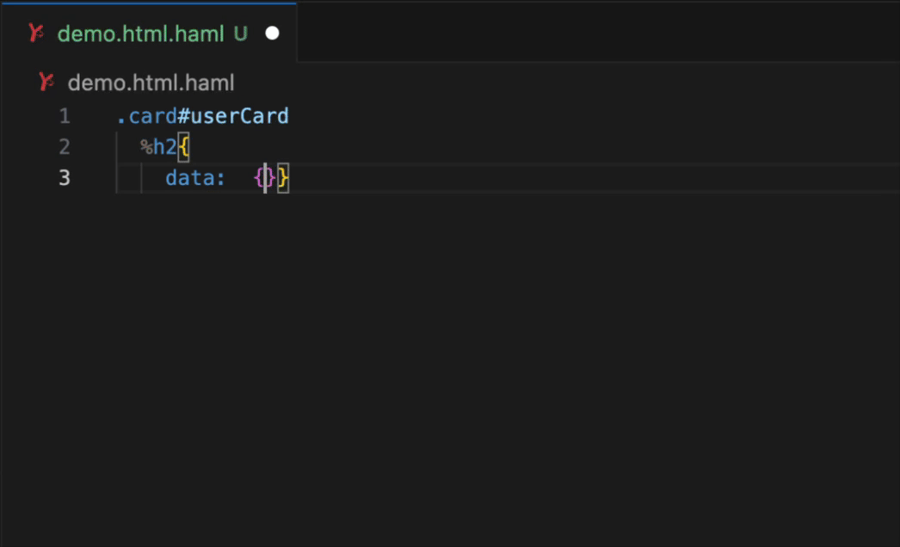

# HAML Hero

Comprehensive HAML support for Visual Studio Code with advanced syntax highlighting, linting, and auto-formatting capabilities.



## Features

- **🎨 Enhanced Syntax Highlighting**: Comprehensive syntax highlighting for all HAML features, including multi-line ruby and hash attributes
- **✨ Auto-Formatting**: Format HAML files on save (powered by [`haml-lint`](https://github.com/sds/haml-lint))
- **🔍 Real-time Diagnostics**: Live linting feedback with warnings and errors as you type (powered by [`haml-lint`](https://github.com/sds/haml-lint))
- **⚙️ Highly Configurable**: Customize linter path, formatter mode, and additional arguments

## Requirements

For auto-formatting and linting, you need to install [haml-lint](https://github.com/sds/haml-lint):

### Project-Level Installation (Recommended)

Add to your `Gemfile`:

```ruby
group :development do
  gem 'haml_lint', require: false
end
```

Then run:

```bash
bundle install
```

### Global Installation


```bash
gem install haml_lint
```
Warning: A global installation will be pinned to a specific version of Ruby that may not match your project

## VS Code Settings

Auto-formatting is enabled under default vscode settings, but if you have another linter installed (like Prettier) you may need to add these settings to your [settings.json file](https://code.visualstudio.com/docs/configure/settings#_user-settings:~:text=Select%20the%20Preferences%3A%20Open%20User%20Settings%20%28JSON%29%20command%20in%20the%20Command%20Palette) to enable HAML formatting.

```json
{
  "[haml]": {
    "editor.defaultFormatter": "XanderDoom.haml-hero",
    "editor.formatOnSave": true,
    "editor.formatOnPaste": true
  }
}
```

## Extension Settings

This extension has the following settings:

### Core Settings

- `hamlHero.enableFormatting`: Enable automatic formatting with haml-lint (default: `true`)
- `hamlHero.enableDiagnostics`: Enable real-time linting diagnostics (default: `true`)

### Linter Configuration

- `hamlHero.linterPath`: Full path to the haml-lint executable (default: `"haml-lint"`)
  - For global installation: leave as `"haml-lint"`
  - For Bundler: use `"bundle exec haml-lint"` or full path to bundle
- `hamlHero.configPath`: Path to a custom .haml-lint.yml config file
  - If not specified, checks workspace root for `.haml-lint.yml`
  - If no config file is found, haml-lint uses its built-in defaults
  - Supports `~` for home directory and relative paths from workspace root
  - Example: `"~/.haml-lint.yml"` or `"config/.haml-lint.yml"`
- `hamlHero.additionalLinterArguments`: Additional arguments to pass to haml-lint when running diagnostics (default: `""`)
- `hamlHero.globallyDisabledLinters`: List of haml-lint rules to disable globally across all projects (default: `[]`)
  - Rules are excluded using haml-lint's `--exclude-linter` flag
  - Applies to both diagnostics and formatting
  - Overrides local workspace .haml-lint
  - Use the Quick Fix menu on any diagnostic to add rules here
  - Example: `["IdNames", "LineLength", "ClassesBeforeIds"]`

### Formatter Settings

- `hamlHero.formatterMode`: Determines which auto-corrections to apply (default: `"safe"`)
  - `"safe"`: Only apply safe auto-corrections (`--auto-correct`)
  - `"all"`: Apply all auto-corrections, including potentially unsafe ones (`--auto-correct-all`)
- `hamlHero.formatInBackground`: When enabled, files save immediately and formatting runs in the background (default: `true`)
  - Provides a more responsive experience
  - Set to `false` if you prefer blocking formatting before save completes
- `hamlHero.additionalFormatterArguments`: Additional arguments to pass to haml-lint when formatting (default: `""`)

### Example Configuration

```json
{
  "hamlHero.linterPath": "bundle exec haml-lint",
  "hamlHero.formatterMode": "all",
  "hamlHero.configPath": "config/.haml-lint.yml",
  "hamlHero.additionalFormatterArguments": "--parallel"
}
```

### Configuring haml-lint Rules

**Option 1: Use workspace config** (recommended for team projects)  
Create `.haml-lint.yml` in your project root. This will automatically be used.

**Option 2: Use custom config location**  
Set `hamlHero.configPath` to point to your config file. This can be configured per-workspace, so if you don't want your config in the same folder as your project, or if you want to share a config across projects, use this.

If no config file is found, haml-lint will use its built-in defaults.

### Disabling Linter Rules

When you hover over a linting diagnostic, you can use the Quick Fix menu (lightbulb icon or `Cmd+.`) to:

- **Disable in this project**: Adds the rule to your project's `.haml-lint.yml` file
- **Disable globally**: Adds the rule to your VS Code user settings (`hamlHero.globallyDisabledLinters`), applying to all projects

You can also manually manage globally disabled rules in your VS Code settings:

```json
{
  "hamlHero.globallyDisabledLinters": ["IdNames", "ClassesBeforeIds"]
}
```

#### Inline Disable Comments

For one-off suppressions, haml-lint supports inline disable comments that you can add manually:

```haml
-# haml-lint:disable IdNames
%div#my_id Content here
-# haml-lint:enable IdNames
```

Or to disable for the rest of the file:

```haml
-# haml-lint:disable IdNames
%div#my_id Content here
%div#another_id More content
```

## Known Issues

Linter warnings and errors highlight the entire line instead of just the offending code. This is [an issue with `haml-lint`](https://github.com/sds/haml-lint/issues/274), and won't be fixed.

Filter blocks (:ruby, :markdown) may not terminate correctly if there is trailing whitespace on the line after the end of the block.

`Format Document` saves document when `formatInBackground` is `true`. It's more common in other linters for `Format Document` to format without saving. It's surprisingly difficult to determine whether formatting was triggered via command or on save. This is a low priority and probably won't be fixed. If this is an issue for you, disable `formatInBackground`.

Please report additional issues on the [GitHub repository](https://github.com/yourusername/haml-hero).

## Development

### Testing Syntax Highlighting

Test fixtures are available in the `test-fixtures/` directory. Open any of these files to verify syntax highlighting:

- `basic-syntax.haml` - Core HAML features
- `filters.haml` - Embedded language filters
- `complex-attributes.haml` - Various attribute syntaxes
- `ruby-integration.haml` - Ruby code integration
- `rails-helpers.haml` - Rails-specific patterns
- `edge-cases.haml` - Special scenarios

Run automated grammar tests:
```bash
npm install
npm run test:grammar          # Run tests
npm run test:grammar:update   # Update snapshots after grammar changes
```

See [test-fixtures/README.md](test-fixtures/README.md) and [docs/TESTING.md](docs/TESTING.md) for more details.

**Enjoy!**
